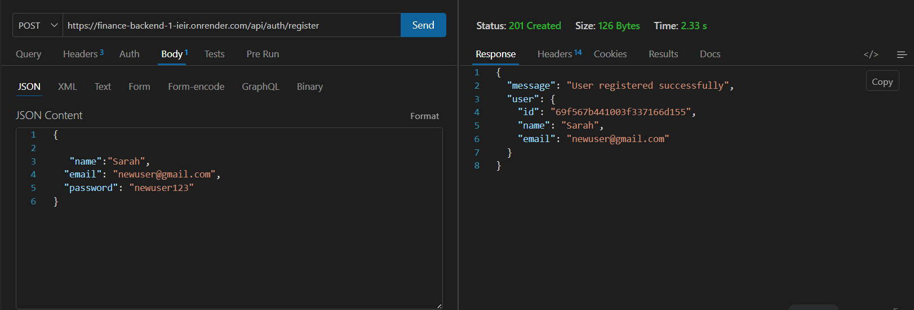
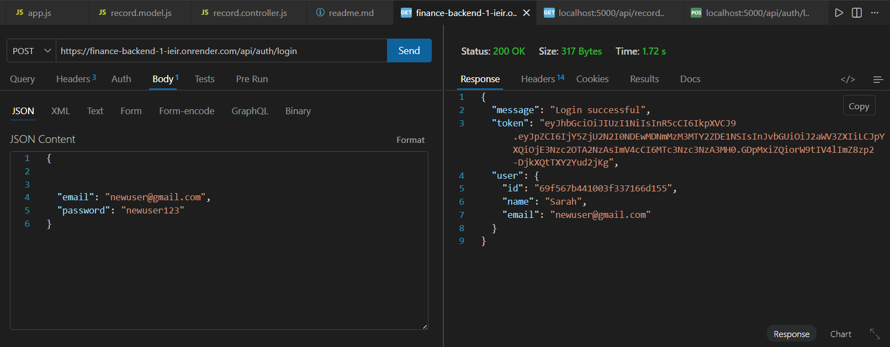

# 💰 Finance Dashboard Backend

A secure, role-based backend system for managing personal financial records.
Built using Node.js, Express, MongoDB, and JWT authentication.

---
# 🌐 Live Demo
👉 Base URL (Render Deployment):
https://finance-backend-1-ieir.onrender.com

Example:

Register → /api/auth/register

Login → /api/auth/login

---


## 🚀 Features

### 🔐 Authentication

* User Registration with password hashing (bcrypt)
* User Login with JWT token generation
* Secure authentication middleware

### 👥 Role-Based Access Control

* **Viewer** → Can only view financial records
* **Analyst** → Can view records + access dashboard summaries and trends
* **Admin** → Full access (create, update, delete records + manage users)

### 💰 Financial Records

* Create financial records (income/expense)
* Get all records (user-specific)
* Update records
* Delete records

### 🔎 Filtering & Pagination

* Filter by type (income / expense)
* Filter by category
* Filter by date range
* Pagination support (page & limit)

### 📊 Dashboard APIs

* Total income, total expense, net balance
* Category-wise breakdown (income & expense)
* Monthly trends (grouped by month/year)

### 👤 User Management (Admin Only)

* Get all users
* Update user role
* Update user status (active / inactive / banned)

### 🔒 Security

* JWT-based protected routes
* Role-based route protection
* User-based data isolation (each user sees only their own data)

---

## 🛠️ Tech Stack

* Node.js
* Express.js
* MongoDB (Mongoose)
* JWT (jsonwebtoken)
* bcryptjs

---

## 📁 Project Structure

```
src/
│
├── controllers/
│   ├── auth.controller.js
│   ├── record.controller.js
│   └── user.controller.js
│
├── models/
│   ├── user.model.js
│   └── record.model.js
│
├── routes/
│   ├── auth.routes.js
│   ├── record.routes.js
│   └── user.routes.js
│
├── middlewares/
│   ├── auth.middleware.js
│   └── role.middleware.js
│
├── config/
│   └── db.js
│
├── app.js
└── index.js
```

---

## ⚙️ Setup Instructions

### 1️⃣ Clone the repository

```bash
git clone https://github.com/ananyamishra13/finance-backend
cd finance-backend
```

### 2️⃣ Install dependencies

```bash
npm install
```

### 3️⃣ Create `.env` file

```
PORT=5000
MONGO_URI=your_mongodb_connection_string
JWT_SECRET=your_secret_key
```

### 4️⃣ Run the server

```bash
node src/index.js
```

Server runs on:
https://finance-backend-1-ieir.onrender.com

---

## 🔐 Authentication Flow

1. Register user
2. Login → get JWT token
3. Use token in all protected requests:
   Authorization: Bearer <token>

---

## 📌 API Endpoints

### 🔑 Auth

| Method | Endpoint           | Description   |
| ------ | ------------------ | ------------- |
| POST   | /api/auth/register | Register user |
| POST   | /api/auth/login    | Login user    |

---

### 💰 Records

| Method | Endpoint         | Access    | Description     |
| ------ | ---------------- | --------- | --------------- |
| POST   | /api/records     | Admin     | Create record   |
| GET    | /api/records     | All roles | Get all records |
| PUT    | /api/records/:id | Admin     | Update record   |
| DELETE | /api/records/:id | Admin     | Delete record   |

---

### 🔎 Filters & Pagination

* GET /api/records?type=income
* GET /api/records?type=expense
* GET /api/records?category=salary
* GET /api/records?startDate=2026-01-01&endDate=2026-04-01
* GET /api/records?page=1&limit=10
* GET /api/records?type=income&page=1&limit=5

---

### 📊 Dashboard

| Method | Endpoint                | Access         | Description              |
| ------ | ----------------------- | -------------- | ------------------------ |
| GET    | /api/records/summary    | Analyst, Admin | Income, expense, balance |
| GET    | /api/records/categories | Analyst, Admin | Category-wise totals     |
| GET    | /api/records/trends     | Analyst, Admin | Monthly trends           |

---

### 👤 User Management

| Method | Endpoint              | Access | Description        |
| ------ | --------------------- | ------ | ------------------ |
| GET    | /api/users            | Admin  | Get all users      |
| PATCH  | /api/users/:id/role   | Admin  | Update user role   |
| PATCH  | /api/users/:id/status | Admin  | Update user status |

---

## 🔒 Role Permissions

| Action                    | Viewer | Analyst | Admin |
| ------------------------- | ------ | ------- | ----- |
| View records              | ✅      | ✅       | ✅     |
| Filter & paginate records | ✅      | ✅       | ✅     |
| View summary & categories | ❌      | ✅       | ✅     |
| View monthly trends       | ❌      | ✅       | ✅     |
| Create records            | ❌      | ❌       | ✅     |
| Update records            | ❌      | ❌       | ✅     |
| Delete records            | ❌      | ❌       | ✅     |
| Manage users              | ❌      | ❌       | ✅     |

---

## 🧪 Testing

Use Thunder Client or Postman:

1. Register a user
2. Login → copy token
3. Add header to all requests:
   Authorization: Bearer <token>
4. Test protected routes

---
# 🧪 API Demo Screenshots
🔹 User Registration

🔹 User Login (JWT Token)



---


## 🧠 Key Concepts Implemented

* REST API design
* JWT Authentication
* Role-Based Access Control (RBAC)
* Middleware chaining
* MongoDB Aggregation
* Pagination
* CRUD operations
* Secure password storage
* User-based data isolation

---

## 📌 Assumptions Made

* Default role for new users is `viewer`
* Role can only be changed by an admin via `/api/users/:id/role`
* Each financial record is tied to the user who created it
* Pagination defaults to page 1 with 10 records per page if not specified
* MongoDB Atlas used for cloud database

---

## 👩‍💻 Author

Ananya Mishra
